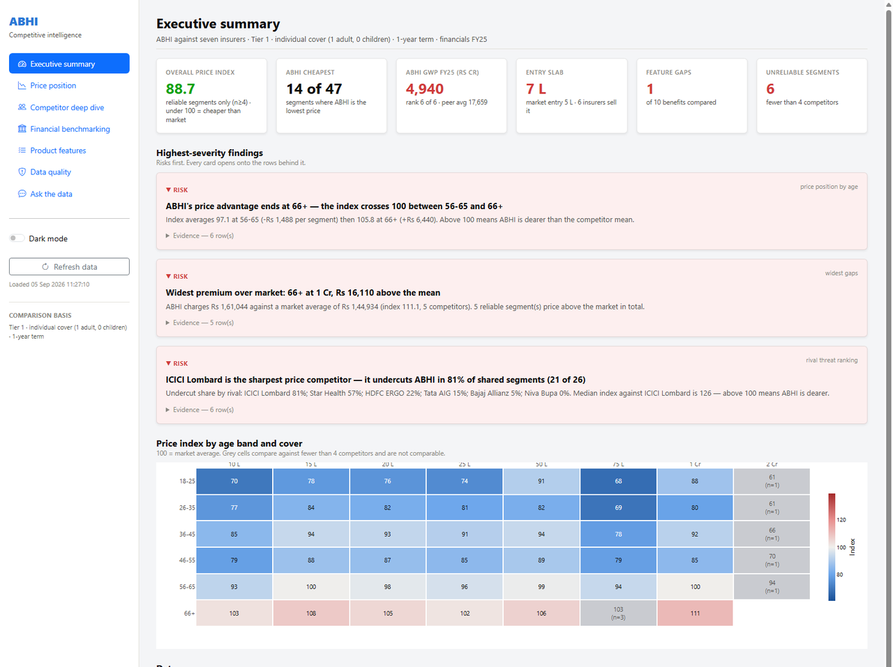
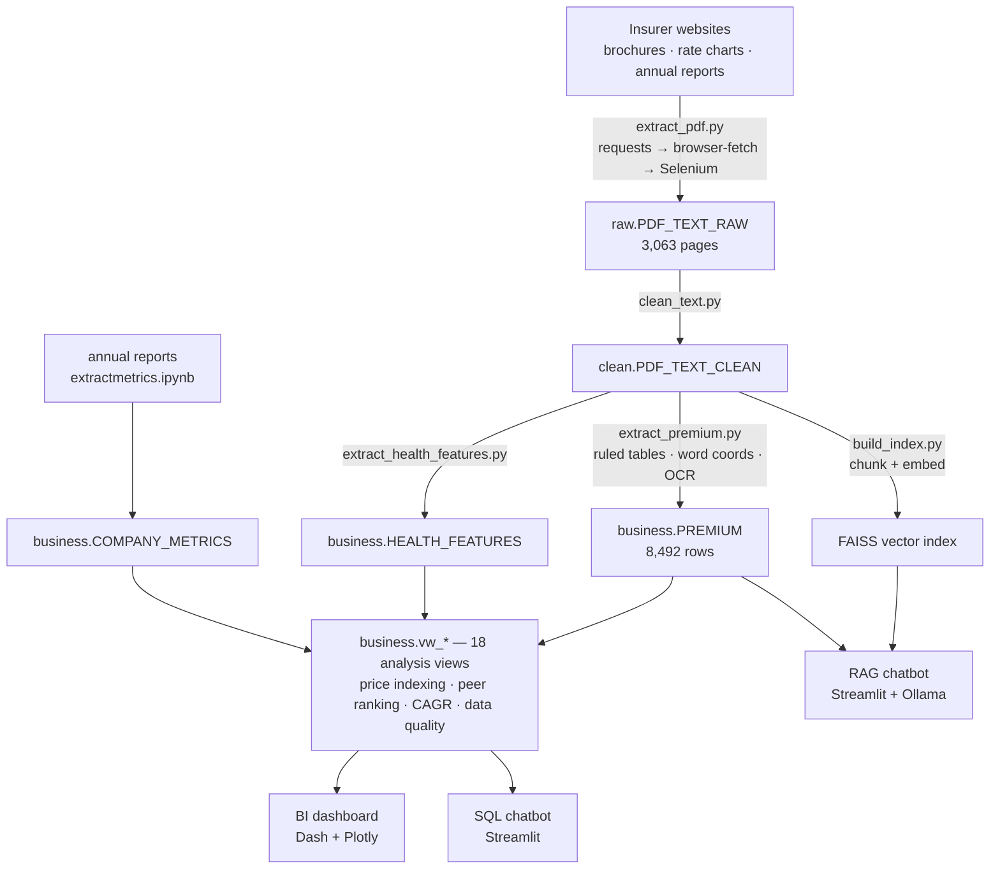
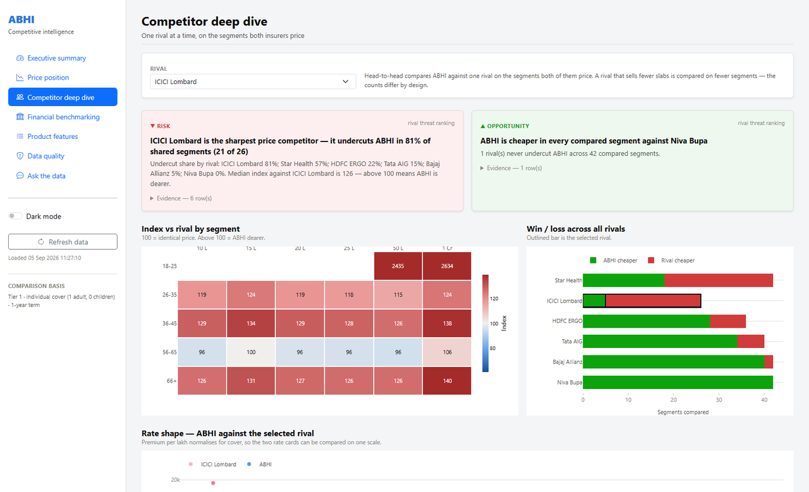
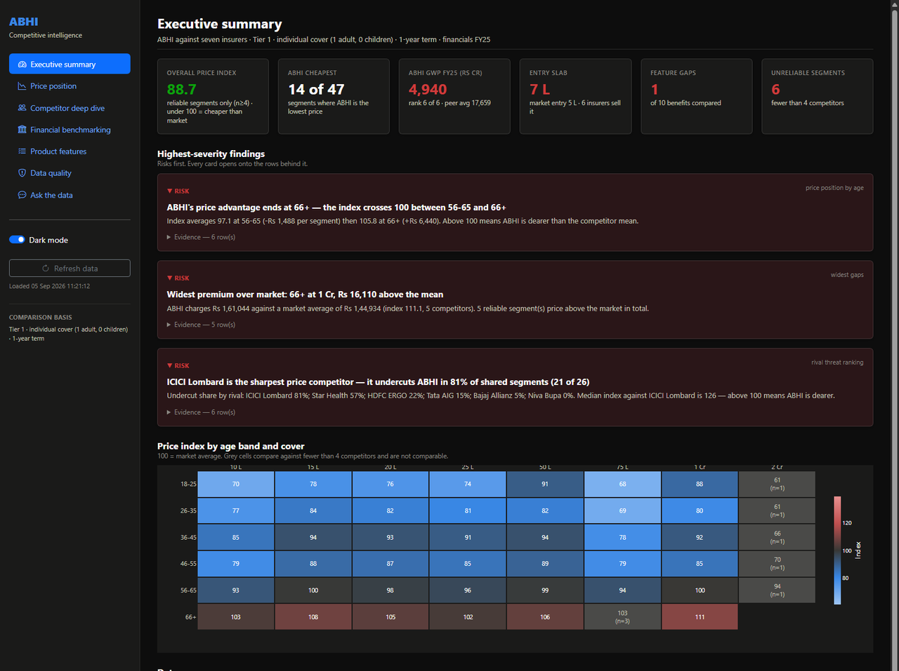
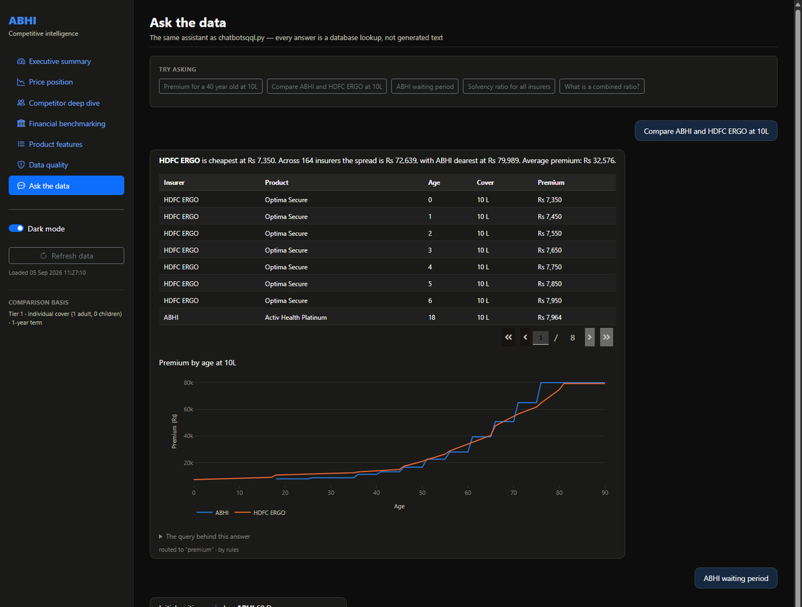
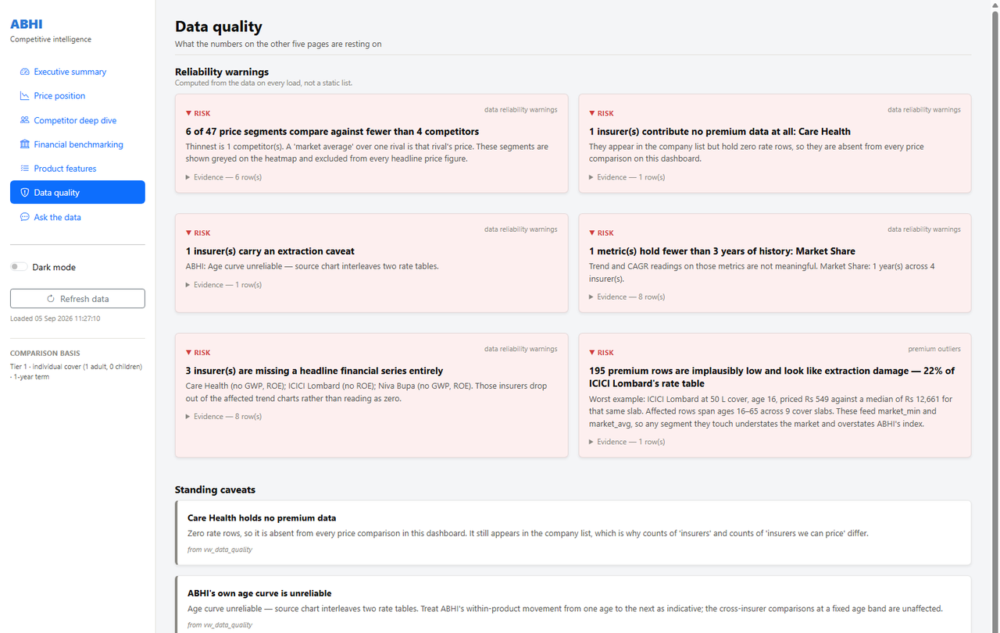

# Health Insurance Competitive Intelligence

Competitive analysis of eight Indian health insurers, built end to end: the
source PDFs are scraped and parsed into SQL Server, the analysis lives in a
view layer, and the findings surface through a BI dashboard and two chatbots.

The focal company is **ABHI** (Aditya Birla Health Insurance), compared against
Bajaj Allianz, Care Health, HDFC ERGO, ICICI Lombard, Niva Bupa, Star Health
and Tata AIG.

Nothing here is sample data. Every premium, policy term and financial figure is
extracted from the insurers' own published brochures, rate charts and annual
reports — 3,063 PDF pages in, 8,492 priced segments out.



---

## What it found

The point of the build is that it produces *answers*, not just charts. Every
finding below is computed from the data at render time, not written by hand —
re-run the pipeline and they change.

| Finding | Evidence |
|---|---|
| **ABHI's price advantage runs out at 66+.** It undercuts the market everywhere else. | Mean price index by age band: 77.9 → 79.4 → 89.6 → 84.6 → 97.1 → **105.8**. The index crosses 100 between 56-65 and 66+. |
| **ABHI doesn't compete at the entry price point.** A shopper starting at the cheapest cover never sees an ABHI quote. | ABHI's lowest slab is ₹7 L. All six competitors with rate data sell from ₹5 L. |
| **ICICI Lombard is the sharpest price threat**, by a wide margin. | Undercuts ABHI in **81%** of shared segments (21 of 26). Next closest is Star Health at 57%; Niva Bupa never undercuts at all. |
| **ABHI is sub-scale on published financials.** | Bottom third on 5 of 6 benchmarked metrics. GWP ₹4,940 Cr against a peer average of ₹17,659 Cr — rank 6 of 6. Its 39.6% GWP CAGR is the fastest in the peer set, from the smallest base. |
| **One real product gap.** | Restoration: ABHI doesn't describe it, 4 of 6 rivals do. The other nine compared benefits are at parity. |
| **22% of one rival's rate table is corrupt** — caught by the pipeline, not by eye. | 195 ICICI Lombard rows sit below 25% of their own slab's median (₹549 for ₹50 L cover at age 16, against a ₹12,661 median). Flagged, quarantined from headline figures, and reported on the Data quality page. |

---

## Architecture



The view layer is deliberately the centre of gravity. Python reads views, never
base tables, so the analytical logic is versioned SQL rather than pandas
scattered across scripts. See [`SQL/`](SQL/) — the whole schema is scripted and
reproducible.

---

## The BI dashboard

```bash
python Python/bi_dashboard.py     # http://127.0.0.1:8050
```

Seven pages: Executive summary, Price position, Competitor deep dive, Financial
benchmarking, Product features, Data quality, and a built-in SQL assistant.

**The insight layer is the design.** [`Python/bi/insights.py`](Python/bi/insights.py)
holds eight functions that each compute a finding and return it as a structured
object — headline, supporting numbers, severity, and the DataFrame that proves
it. Pages lead with the findings; the charts underneath support them. A function
that finds nothing returns nothing rather than inventing a result.

```python
@dataclass
class Insight:
    headline: str          # the finding, in one sentence
    detail: str            # the numbers behind it
    severity: str          # 'opportunity' | 'risk' | 'neutral'
    evidence: pd.DataFrame # the rows that justify it
```

Every card opens onto its own evidence rows, so a claim on screen is one click
from the data underneath it.

<table>
<tr>
<td width="50%"></td>
<td width="50%"></td>
</tr>
<tr>
<td align="center"><em>Head-to-head against one rival</em></td>
<td align="center"><em>Both themes are selected, not inverted</em></td>
</tr>
</table>

Charts follow a documented colour method rather than taste. The categorical
palette is validated with a script — OKLab ΔE under a Machado-2009
colour-vision-deficiency simulation, a lightness band, a chroma floor and WCAG
contrast against the actual surface. That caught a real bug: the reference dark
violet sat at ΔE 1.9 from the dark blue under CVD simulation, well below the
floor of 8, which would have made ABHI and Star Health indistinguishable on the
dark scatter. The slot was re-stepped to a purple that clears the gate against
all seven other series (worst ΔE 9.5).

---

## The two chatbots

| | [`chatbotsqql.py`](Python/chatbotsqql.py) | [`chatbot.py`](Python/chatbot.py) |
|---|---|---|
| Approach | SQL only | SQL first, RAG as fallback |
| Numeric questions | Parameterised SQL | Parameterised SQL |
| Policy-wording questions | Fixed glossary + regex-matched columns | Vector search over the brochures, explained by a local LLM |
| Generates prose? | Never | Only where SQL has nothing |

```bash
streamlit run Python/chatbotsqql.py   # SQL only
streamlit run Python/chatbot.py       # SQL + RAG  (needs: ollama pull qwen2.5:3b)
```

**The LLM routes; it never answers.** Question handling runs in three tiers, and
the model is the last one:

1. **Deterministic parsing.** Ages, cover amounts, insurer names, metrics and
   financial years are pulled out with regex matched against the database's
   actual contents — so "40 year old at 10L", "1cr", "FY23" and "Aditya Birla"
   all resolve without a model.
2. **Keyword routing.** If the question names a metric, a policy term or a
   glossary entry, that decides the route.
3. **The model**, only when both fail — and it returns a JSON route
   (`{"intent": "metric", "company": "ABHI", "year": 2023}`), never prose. That
   route feeds the same parameterised query builders as tier 1.

The consequence is that a wrong model output produces a clarifying question, not
a wrong number. Every answer ships with the SQL that produced it, one click away.

**Why SQL runs before retrieval.** SQL returning zero rows is an unambiguous
"not in the database", so falling back to retrieval is safe. Retrieval has no
such signal — it always returns its nearest chunks however irrelevant, so it can
never tell you it failed. The reliable source has to go first.



---

## Data quality is a feature, not a footnote

The dashboard has a Data quality page that is reachable from the sidebar like
any other, because a number is only as good as what it rests on. It reports,
computed fresh on every load:

- **Thin comparisons.** 6 of 47 price segments compare against fewer than four
  competitors. A "market average" drawn against one rival is that rival's price,
  so those segments are greyed on every heatmap, labelled with their competitor
  count, and excluded from all headline figures.
- **Extraction damage.** The 195 implausible ICICI Lombard rows, detected by a
  within-group median rule rather than an absolute threshold — premium per lakh
  legitimately falls at high cover, so an absolute floor would condemn real
  pricing.
- **Absent insurers.** Care Health contributes zero rate rows and is absent from
  every price comparison, which is why "insurers tracked" and "insurers we can
  price" are different counts.
- **Short histories.** Market share appears for one year only; combined ratio is
  reported by nobody, which is why no combined-ratio chart exists anywhere.
- **A stated caveat on ABHI's own data** — its source rate chart interleaves two
  rate tables, so its within-product age curve is unreliable even though the
  cross-insurer comparisons at a fixed age band are not.



---

## The extraction problem

Getting 8,492 clean rate rows out of eight insurers' PDFs is most of the work,
because no two publish the same way.

**Downloading** escalates through three tiers ([`extract_pdf.py`](Python/extract_pdf.py)).
Plain `requests` works for most sites. Some WAFs fingerprint the requests library
specifically, so tier 2 runs a real headless Chrome session and issues the fetch
from inside the page's own JS context, carrying its cookies and TLS fingerprint.
Tier 3 falls back to letting Chrome's download manager save the file. The stage
is idempotent — a document is skipped only when the file *and* its SQL rows both
already exist.

**Parsing rate charts** ([`extract_premium.py`](Python/extract_premium.py)) needs
a different strategy per insurer:

| Strategy | Insurers | Why |
|---|---|---|
| Ruled table extraction | ABHI, Bajaj, HDFC ERGO, Niva Bupa, Tata AIG | Clean bordered tables |
| Word-coordinate reconstruction | Star Health | PyMuPDF emits one line per *cell*, so rows are rebuilt from x/y positions |
| Tesseract OCR | ICICI Lombard | The rate chart is an image, with no text layer at all |

Two guards keep garbage out: tables headed with *Member* / *Discount* /
*Illustrative* are skipped (HDFC ERGO's floater-discount worked example reads
exactly like a rate table but is four family members, not an age series), and any
composition covering fewer than ten distinct ages is discarded as an
illustration rather than a chart.

---

## Repository layout

```
Python/
  bi_dashboard.py          the dashboard entry point
  bi/                      data · insights · theme · components · 7 pages
  chatbotsqql.py           SQL-only chatbot (Streamlit)
  chatbot.py               SQL + RAG chatbot (Streamlit + Ollama)
  chatbot_core.py          shared routing, queries and glossary
  build_index.py           FAISS index for the RAG bot
  run_all.py               pipeline orchestrator (4 stages, subprocess-isolated)
  extract_pdf.py           stage 1 — download + text extraction
  clean_text.py            stage 2 — normalisation
  extract_premium.py       stage 3 — rate charts → PREMIUM
  extract_health_features.py  stage 4 — brochures → HEALTH_FEATURES
  extract_products.py      seeds PRODUCT_MASTER
  extractmetrics.ipynb     annual reports → COMPANY_METRICS

SQL/                       schemas, tables, 18 views, seed data — see SQL/README.md
Companies/                 pdf_links.json per insurer — the source URLs
docs/                      screenshots
```

`chatbot_core.py` is shared by the Streamlit SQL bot and the dashboard's
assistant page, so a question is answered identically wherever it's asked.

---

## Setup

```bash
python -m venv .venv
.venv\Scripts\activate
pip install -r requirements.txt
```

Then build the database — the schema is fully scripted, so this works from
nothing:

```sql
-- select your target database first; the scripts carry no USE statement
:r SQL/01_schemas.sql
:r SQL/02_tables.sql
:r SQL/03_views.sql
:r SQL/04_seed_reference_data.sql
```

```bash
python Python/extract_products.py   # seed PRODUCT_MASTER
python Python/run_all.py            # PDFs → raw → clean → PREMIUM + features
python Python/build_index.py        # only needed for the RAG chatbot
```

Also required: **SQL Server** with `ODBC Driver 17`, **Google Chrome** (for the
Selenium download tiers), **Tesseract OCR** at
`C:\Program Files\Tesseract-OCR\tesseract.exe` (only for ICICI Lombard's
image-only rate chart), and **Ollama** with `qwen2.5:3b` for the RAG bot.

### Configuration

Connection settings live in one place — [`Python/db.py`](Python/db.py) — and are
read from the environment, so pointing the project at another machine means
setting variables rather than editing files. Every default reproduces the
original development box, so it runs with nothing set.

| Variable | Default | |
|---|---|---|
| `INSURANCE_DB_SERVER` | `AKSHAT\SQLEXPRESS` | SQL Server instance |
| `INSURANCE_DB_NAME` | `INSURANCEDB` | Database |
| `INSURANCE_DB_DRIVER` | `ODBC Driver 17 for SQL Server` | ODBC driver |
| `INSURANCE_DB_USER` / `INSURANCE_DB_PASSWORD` | *(unset)* | Set both to use a SQL login; otherwise Windows auth |
| `GROQ_API_KEY` | *(unset)* | Optional — enables the chatbot's tier-3 routing. Without it routing stops after tier 2 and says so; nothing breaks |

```bash
set INSURANCE_DB_SERVER=YOURHOST\SQLEXPRESS
python Python/bi_dashboard.py
```

Credentials are only ever read from the environment — nothing is written to
disk, and `db.describe()` deliberately prints the target without the password.

---

## Known limitations

Stated here rather than discovered later:

- **Premiums are Tier 1, individual cover (1 adult, 0 children), 1-year term**
  throughout. Family floater rates exist for only a few insurers.
- **Niva Bupa is the Bronze variant only.** Higher tiers of the same product
  aren't in the dataset, so it reads cheaper than its full range would suggest.
  This one is an analyst note with no column behind it, and is labelled as such
  in the dashboard.
- **Benefit flags are keyword-derived from brochure text.** A tick means the
  benefit is described positively in the source document — not that it is
  covered under the base plan, and not at any limit. The numeric policy terms
  are document-verified and are the sounder comparison.
- **ICICI Lombard's OCR rows are lower-confidence** than the ruled-table
  insurers, and 195 of them are known-bad (see above).
- Financial-year coverage is uneven: GWP holds 5 years across 6 insurers, ROE 5
  across 5, market share 1 year across 4, combined ratio none.
